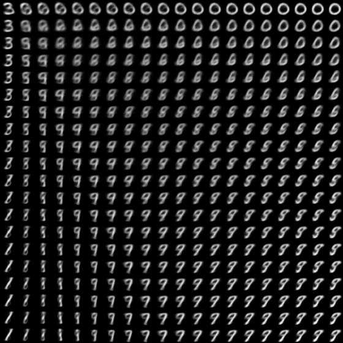
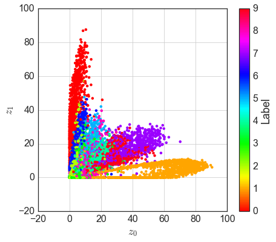
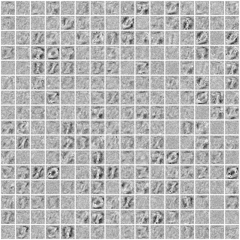
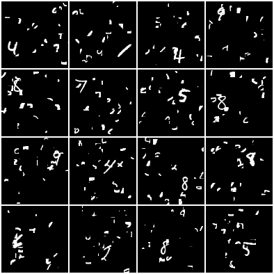

keras-information-dropout
=========================

> Achille, A., & Soatto, S. (2016). *Information Dropout: learning optimal representations through noise.* arXiv:1611.01353

[Keras](https://keras.io/) implementation of the Information Dropout ([arXiv:1611.01353](https://arxiv.org/abs/1611.01353)) paper.










## Usage

### Generate dataset

```bash
$ luajit download_mnist.lua
$ luajit make_cluttered_dataset.lua
$ python t7_to_hdf5.py
```

### Training

```bash
$ python train.py /path/to/hdf/data/file
```

```
usage: train.py [-h] [--img-size IMG_SIZE IMG_SIZE] [--beta BETA]
                [--kernel-size KERNEL_SIZE KERNEL_SIZE]
                [--nb-filters NB_FILTERS NB_FILTERS NB_FILTERS NB_FILTERS]
                [--model-path MODEL_PATH] [--weights-path WEIGHTS_PATH]
                [--lr LR] [--nb-epoch NB_EPOCH] [--batch-size BATCH_SIZE]
                [--name NAME] [--rootdir ROOTDIR]
                datapath

Training All-CNN-96 network.

positional arguments:
  datapath              /path/to/hdf/data/file

optional arguments:
  -h, --help            show this help message and exit
  --img-size IMG_SIZE IMG_SIZE
                        pixel size of input image (default: (96, 96))
  --beta BETA           hyper parameter for KL penalty (default: 1.0)
  --kernel-size KERNEL_SIZE KERNEL_SIZE
                        kernel size of Conv2D layer (default: (3, 3))
  --nb-filters NB_FILTERS NB_FILTERS NB_FILTERS NB_FILTERS
                        number of filters for Conv2D blocks (default: [32, 64,
                        96, 192])
  --model-path MODEL_PATH
                        json file defining model architecture (default: None)
  --weights-path WEIGHTS_PATH
                        hdf5 file containing network parameters (default:
                        None)
  --lr LR               initial learning rate (default: 0.01)
  --nb-epoch NB_EPOCH   number of epochs (default: 80)
  --batch-size BATCH_SIZE
                        batch size (default: 128)
  --name NAME           experiment name (default: None)
  --rootdir ROOTDIR     root directory for saving results (default: ./)
```